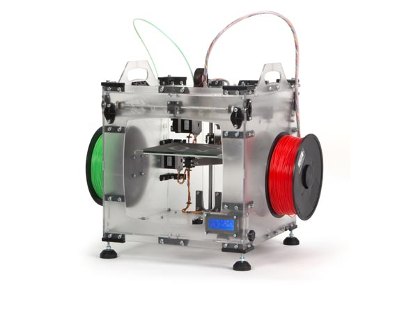

# Vertex 3D printer

## Deltaker

  - William
  - Morten
  - Jiwen
  - Abdinasir
  - Bashir
  - Nico
  
## Status

## Specifikasjoner

Datasheet
  - http://www.velleman.co.uk/contents/en-uk/k8400d.pdf

Manual
  - https://manuals.velleman.eu/category.php?id=2/

Nedlastingsside
  - https://vertex3dprinter.eu/downloads/vertex-downloads/

### Bevegelsessystem
Vertex bruker et beltesystem bygget opp av 4 belter i en firkant i toppen av 3d printeren. Beltene er koblet til 2 andre belter, som er koblet til 2 motorer.
Platformen til 3d printeren kan gå opp og ned sånn at printeren kan printe i høyden.

## Mangende deler

## Ting som må fikses

Belte
  - Beltet på 3d printer er for slakk og må strammes på en måte.

Stepper Drivere
  -Den bruker DRV8825 Stepper drivere
  -STEP og DIR pins er de "interessante", DIR pinen styrer retning og STEP styrer "fart" på motor.
